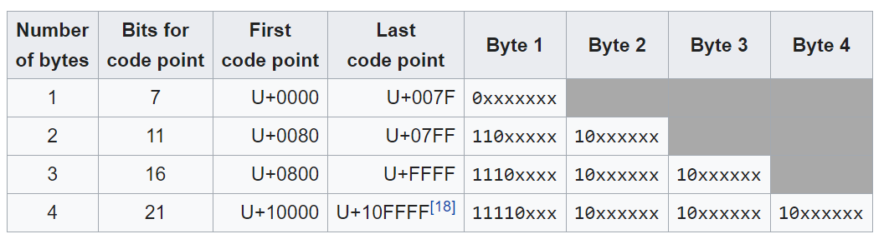

# Tokenization (BPE)

Here, we discuss a minimalist example for Byte Pair Encoding. Few terminologies first:

1. Unicode: 
    1. Character encoding standard. It assigns a code to characters belonging to various languages, emojis and symbols.
    2. Common Encoding formats include: UTF-8, UTF-16, UTF-32
    3. A code can be represented by 1 to 4 bytes. UTF-8 has variable byte length, whereas UTF-16 and UTF-32 have fixed byte lengths. UTF-8 is more space efficient, because UTF-16 and UTF-32 pad smaller codes with 0s.
    4. Due to varying lengths, UTF-8 uses the number of set bits in the first 1, 2, 3, or 4 bits to find how many succeeding bytes belong to the current character.
    
    
    

1. We first encode a string using UTF-8. This gives us a sequence of byte level representations. Some characters may just have 1 byte, while some may even have 4 bytes. Example:

    
    ```bash
    >>> list("**안**녕하세요 👋 (hello in Korean!)".encode("utf-8")
    [**236, 149, 136, 235**, 133, 149, 237, 149, 152, 236, 132, 184, 236, 154, 148, 32, 240, 159, 145, 139, 32, 40, 104, 101, 108, 108, 111, 32, 105, 110, 32, 75, 111, 114, 101, 97, 110, 33, 41]
    ```
    
    Here list converts each byte representation to an integer.
    
2. Since each entry in the list is byte level, it can be from 0 to 255. Initially, the vocabulary contains all possible individual byte values (0-255). Each token initially corresponds to exactly one byte value.

3. We would like to merge pairs of bytes that occur the most frequently. For example if pairs (237, 149) occur the most frequently, we perform a merge operation, merging (237, 149) represented by the number 256, and 256 is added to the vocabulary. Future merges treat 256 as a single unit. We iteratively perform merges (n times) based on desired vocabulary size. Final vocabulary size = 256 + n. When iteratively merging, frequency for adjacent pairs is re-calculated.

4. Use encode and decode to handle the merged pairs accordingly.

### Tokenization Benefits

1. Helps attention mechanism to attend more characters due to meaningful character groupings 
2. Tokenizing text at subword levels drastically reduces vocabulary size compared to word-level tokenization
3. Rare words are naturally decomposed into known subwords, enabling models to represent and generalize from their meaning accurately.
4. BPE is lossless.

### Disadvantages

Check out: https://youtu.be/zduSFxRajkE?t=6702